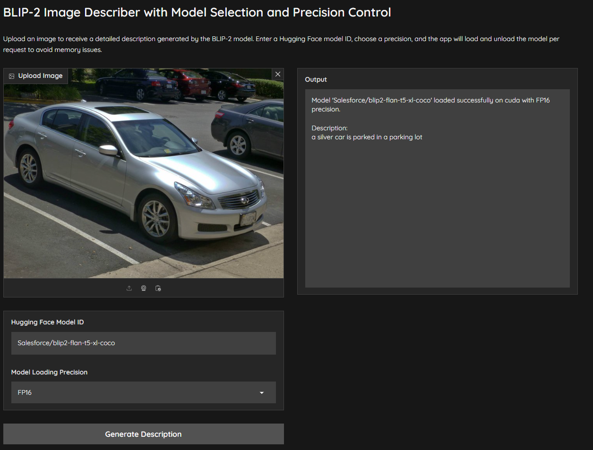

# BLIP-2 Image Describer with Model Selection and Precision Control

This Gradio application uses BLIP-2 with Flan-T5 to generate detailed descriptions of uploaded images. The app allows users to select different Hugging Face model IDs, specify precision (FP16, INT8, BF16, or FP32), and dynamically load models for optimal performance on various hardware configurations.

## Features
- Choose a Hugging Face model ID for flexible model selection.
- Select precision modes (FP16, INT8, BF16, FP32) to optimize performance based on hardware.
- Detailed, long-form descriptions generated with beam search and repetition controls.

## Setup
1. **Clone the repository**:

2. **Install dependencies**:
   ```bash
   pip install -r requirements.txt
   ```

3. **Run the application**:
   ```bash
   python app.py
   ```

4. **Access**:
   Open the app in your browser at `http://localhost:7862`.

## Screenshot


## License
This project is licensed under the MIT License.
